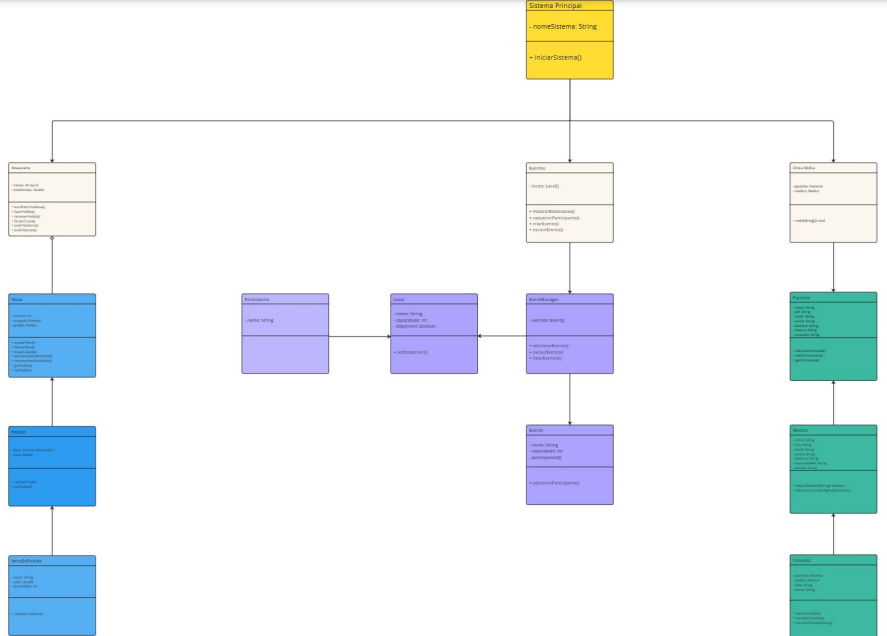
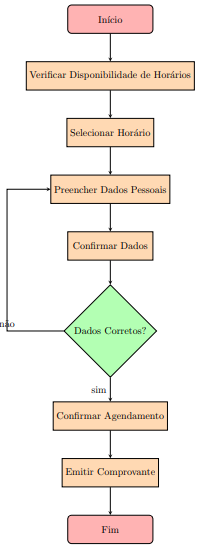

# UNIVERSIDADE CATÓLICA DE PERNAMBUCO

   
  

  # ÍNDICE
* [Índice](#índice)
* [Descrição do Projeto](#descrição-do-projeto)
* [Case 1](#Case-1)
* [Case 2](#Case-2)
* [Case 3](#Case-3)
* [Perguntas para facilitar a tomada de decisão](#Perguntas-para-facilitar-a-tomada-de-decisão)
* [Conceitos SOLID utilizados](#Conceitos-SOLID-utilizados)
* [Beneficios da integração com os principios SOLID](#Beneficios-da-integração-com-os-principios-SOLID)
* [Diagrama de classes UML](#Diagrama-de-classes-UML)
* [Fluxo de diagrama UML](#Fluxo-de-diagrama-UML)
* [Desenvolvedores do Projeto](#desenvolvedores-do-projeto)
* [Tecnologias utilizadas](#tecnologias-utilizadas)
* [Licença](#licença)

  # DESCRIÇÃO DO PROJETO

  

O objetivo deste projeto é desenvolver uma aplicação em Java que simule sistemas de gerenciamento para três cenários distintos: uma clínica médica, um sistema de eventos e um restaurante. A aplicação será capaz de modelar e manipular objetos que representem os elementos principais desses sistemas, utilizando noções de manipulação de classes, atributos, métodos, conceitos de decisão e repetição, modularização e encapsulamento.
  

# CASE 1

## SISTEMA DE GERENCIAMENTO DE CLÍNICA MÉDICA

### Feito por:
 - Adryan Rafael

## Como este sistema funciona?

O sistema de gerenciamento de clínica médica possui uma interface simples para o usuário, permitindo o controle eficiente dos atendimentos médicos com as seguintes funções:

- Marcar consultas
- Cancelar consultas
- Concluir consultas
- Exibir prontuário de pacientes
- Análise de consultas e gestão de agenda médica

## Classes

As classes seguem o paradigma de orientação a objetos e são projetadas para facilitar o gerenciamento de médicos, pacientes e consultas dentro da clínica. O sistema inclui classes para "Paciente", "Medico" e "Consulta", além da classe "ClinicaMedica" que integra essas funcionalidades para uso prático.

### -> Consulta
  

Esta classe tem como objetivo definir uma consulta. A consulta possui: Paciente, Médico, Data da Consulta, e Status da Consulta (Agendada, Cancelada ou Concluída). Seus atributos são protegidos por encapsulamento, com um construtor definido, bem como os métodos _getters_ e _setters_.

A classe Consulta pode:
- Exibir detalhes da consulta
- Concluir a consulta com um resultado médico
- Cancelar uma consulta
- Atualizar o status da consulta

### -> Medico

Esta classe tem como finalidade definir um médico. Um médico possui: Nome, CRM, Especialidade, Horário de Atendimento, e uma lista de consultas atribuídas a ele. Seus atributos estão encapsulados, e os métodos _getters_ e _setters_ estão definidos.

A classe Medico pode:
- Verificar a disponibilidade para uma data específica
- Adicionar uma consulta à sua agenda
- Exibir todas as consultas agendadas

### -> Paciente

Esta classe define um paciente. Um paciente possui: Nome, CPF, Email, Senha, Telefone, Histórico Médico e Convênio. Seus atributos estão protegidos, e os métodos _getters_ e _setters_ estão definidos.

A classe Paciente pode:
- Adicionar uma consulta ao seu prontuário
- Exibir o prontuário completo com todas as consultas realizadas

### -> ClinicaMedica

Esta classe reúne todas as outras classes e métodos mencionados, permitindo que o sistema funcione de forma integrada para o usuário final. Ela contém um método `main(String[] args)` que inicializa o sistema e oferece uma interface interativa com opções numéricas para uso.

O usuário pode:
- Marcar consultas
- Cancelar consultas
- Concluir consultas
- Exibir prontuário de pacientes
- Exibir informações gerais e específicas de consultas

Dentro das opções de análise, há 5 funcionalidades que respondem a perguntas e facilitam a tomada de decisão no gerenciamento da clínica médica. São elas:

- Quantas consultas estão agendadas para um médico específico?
- Quantas consultas foram canceladas?
- Qual foi o resultado da última consulta realizada?
- Qual é a próxima consulta do paciente?
- Há algum horário disponível para uma nova consulta no dia X?

# CASE 2

## SISTEMA DE GERENCIAMENTO DE EVENTOS

### Feito em conjunto por:
 - Jonas Mendes
 - José Roberval

\* _Este sistema é um case participativo dos três cases pedidos pelo professor Lucas Rodolfo, feitos em paralelo com o auxílio de Adryan Rafael, Lucas Vinícius e Gabriel de Souza._

## Como este sistema funciona?

O sistema de gerenciamento de eventos permite ao usuário realizar diversas operações relacionadas à gestão de eventos, como criação de eventos, gerenciamento de participantes e visualização de estatísticas. Com a refatoração recente, o sistema agora está mais modular e funcional, utilizando estruturas de dados como `ArrayList` para otimizar o gerenciamento das informações.

As funcionalidades disponíveis no sistema são:

- **Cadastro de eventos**: Permite criar novos eventos com nome, capacidade e local.
- **Exclusão de eventos**: Permite remover eventos do sistema.
- **Adição de participantes**: Permite cadastrar participantes em eventos, caso haja espaço disponível.
- **Remoção de participantes**: Permite remover participantes de eventos.
- **Exibição de estatísticas**: Exibe informações gerais sobre todos os eventos ou detalhes específicos sobre um evento.

## Estrutura de Classes

As classes foram refatoradas para serem mais coesas, com o objetivo de melhorar a reutilização de código e seguir boas práticas de orientação a objetos. As principais classes são:

### -> Event (Evento)
  
\* _Classe e métodos definidos por Jonas_

A classe **Event** representa um evento no sistema. Cada evento possui os seguintes atributos:

- **Nome**: O nome do evento.
- **Capacidade**: O número máximo de participantes do evento.
- **Participantes Inscritos**: A lista de participantes registrados no evento.
- **Local**: O local onde o evento ocorre.

A classe Event permite:

- Adicionar participantes ao evento, caso haja capacidade disponível.
- Remover participantes do evento.
- Exibir as estatísticas de participantes do evento, como o número de inscritos e o total de capacidade.

### -> Local (Local do Evento)

\* _Classe e métodos definidos por Roberval_

A classe **Local** representa os locais onde os eventos são realizados. Cada local possui os seguintes atributos:

- **Nome**: O nome do local.
- **Capacidade**: A capacidade máxima do local.
- **Disponibilidade**: Um indicador de se o local está disponível para novos eventos.
- **Eventos Atribuídos**: A lista de eventos realizados no local.

A classe Local permite:

- Atribuir eventos a um local.
- Verificar a ocupação do local (se já há eventos programados).
- Exibir informações detalhadas sobre o local.

### -> Participante (Participante do Evento)

\* _Classe e métodos definidos por Roberval_

A classe **Participante** representa um participante em um evento. Cada participante tem um nome e pode ser associado a um evento. Os participantes podem ser adicionados ou removidos dos eventos.

A classe Participante agora herda de **Usuario** para reaproveitar funcionalidades comuns, como o nome.

### -> MenuEventos (Menu de Navegação do Sistema)

\* _Classe e métodos feitos em conjunto por Jonas e Roberval_

A classe **MenuEventos** centraliza a interação com o usuário. Ela oferece um menu principal que permite o acesso a todas as funcionalidades do sistema, como a criação e exclusão de eventos, e a adição ou remoção de participantes. O menu é exibido repetidamente até que o usuário escolha sair.

As opções disponíveis no menu são:

- **Criar evento**: Permite criar um evento novo, especificando nome, capacidade e local.
- **Excluir evento**: Permite excluir um evento existente.
- **Adicionar participante**: Permite cadastrar um participante em um evento.
- **Remover participante**: Permite remover um participante de um evento.
- **Exibir estatísticas gerais**: Exibe informações gerais sobre todos os eventos.
- **Exibir estatísticas de evento específico**: Exibe informações detalhadas sobre um evento específico.

---

### Alterações Importantes no Sistema:

- **Uso de ArrayList**: O sistema agora utiliza `ArrayList` para gerenciar os participantes e eventos, proporcionando maior flexibilidade e simplificação no código.
- **Remoção de manipulação de arquivos**: A lógica de leitura e escrita de arquivos foi removida, e os dados agora são manipulados diretamente em memória.
- **Melhoria nas buscas e interações**: O sistema foi aprimorado com métodos de busca para eventos e participantes, tornando-o mais eficiente e fácil de usar.

Este sistema agora oferece uma experiência mais fluida e organizada, permitindo ao usuário gerenciar eventos e participantes de forma simplificada e com um design orientado a objetos mais eficiente.

# CASE 3

# SISTEMA DE GERENCIAMENTO DE RESTAURANTE

### Feito em conjunto por:
- Gabriel Araújo;
- Lucas Vinícius;

## Como este sistema funciona?

O sistema de gerenciamento de restaurante tem o intuito de auxiliar os garçons e garçonetes em seus trabalhos para registrar e manipular os pedidos dos clientes que ocupam o estabelecimento. A estrutura desse algoritmo opera sobre os cenários:

- Ocupação de Mesa;
- Anotar Pedidos;
- Remover Pedido;
- Fechar Conta de uma Mesa;
- Imprimir Relátorio Atual dos Pedidos das Mesas;

## Classes

As classes do códigos realizam as funções que foram requisitadas pelo professor avaliador com o intuito de gerar um sistema coeso e funcional, contribuindo para que o código em sua totalidade opere com êxito ao ajudar os trabalhadores que necessitam do mesmo.

### -> SistemaRestaurante

\* _Classe e métodos definidos por Lucas_

Esta classe é a estrutura mais importante do código, uma vez que ele carrega a main dele e conecta as demais classes afim de permitir que o codigo seja efetuado com sucesso. 

Ela carrega consigo algumas funções que realizam as operações supracitadas e faz a chamada das outras classes.

### -> Mesa 

\* _Classe e métodos definidos por Gabriel_ e Lucas_

O intuito da criação dessa classe está na capacidade de verificação da disponibilidade de uma mesa e na inserção do cliente a mesa escolhida por ele. Dessarte, ela conta com métodos para adicionar itens à mesa selecionada previamente, assim como remover e vizualizar os pedidos.

### -> Pedido

\* _Classe e métodos definidos por Gabriel_ e Lucas_

A classe Pedido representa o conjunto de itens consumidos em uma única mesa no restaurante.

### -> itensDoPedido

\* _Classe e métodos definidos por Gabriel_ e Lucas_

O objetivo dessa classe se limita a impressão e a construção das informações que cincundeiam um pedido, armazenando informações sobre ele tais como o nome do produto e preço.

### -> Gerenciador de Mesas
\* _Classe e métodos definidos por Gabriel_

A classe GerenciadorDeMesas é responsável por controlar e organizar as mesas disponíveis no restaurante. Ela gerencia o estado de ocupação das mesas e interage com outras classes para realizar operações relacionadas ao fluxo de atendimento.

### -> Gerenciador de Vendas
\* _Classe e métodos definidos por Gabriel_

A classe a seguir tem como objetivo organizar os gastos totalizados do consumo de um cliente numa mesa e somá-los conforme estabelecido na classe Cardápio para sinalizar ao consumidor o quanto ele deve pagar. 

### -> Cardápio

\* _Classe e métodos definidos por Gabriel_ e Lucas_

Esta classe visa trazer a temática do código abordado ao expor um cardápio criado pela equipe para simbolizar as opções de ofertas que o restaurante trás.

### IMPLEMENTAÇÃO DO MÉTODO SOLID

S - Single Resposibility Principle: A classe Pedido tem a responsabilidade exclusiva de gerenciar os itens consumidos em um pedido. Ela é responsável apenas por armazenar os itens do itensDoPedido, calcular o total do pedido e exibir o pedido. Não há outras responsabilidades dentro desta classe, como, por exemplo, manipular a ocupação das mesas, que é tratada pela classe Mesa.

O - Open/Closed Principle: A classe de Gerenciador De Mesas pode ser estendida para adicionar novos métodos ou comportamentos sem modificar o código existente.

L - Liskov Substitution Principle: Se em algum momento for necessário criar subclasses de Mesa ou Pedido, essas devem funcionar corretamente em qualquer parte do código que esperar um objeto da classe Mesa ou Pedido.

I - Interface Segregation Principle: Em vez de criar uma interface única e complexa para todas as operações do sistema, o código se divide em classes específicas como Pedido, Mesa e GerenciadorDeMesas, cada uma com responsabilidades bem definidas. Desse modo, percebe-se que cada classe oferece métodos específicos e relacionados ao seu contexto.

D - Dependency Inversion Principle: A classe GerenciadorDeMesas depende de interfaces ou classes abstratas como o GerenciadorDeVendas para processar o total das vendas. Isso permite que a implementação do GerenciadorDeVendas seja alterada sem afetar a GerenciadorDeMesas, já que ambas as classes não dependem diretamente de uma implementação concreta, mas de abstrações.

# Perguntas para facilitar a tomada de decisão

Para cada case, algumas perguntas que facilitam a tomada de decisão foram implementadas. 

### Case 1

- Quantas consultas estão agendadas para o médico?
- Qual é a próxima consulta do paciente?
- Quantas consultas foram canceladas pelo médico ou pelo paciente?
- Qual foi o resultado da última consulta realizada?
- Há algum horário disponível para uma nova consulta no dia X?

### Case 2 -Gerenciamento de eventos

- Qual o evento registrado com maior taxa de adesão?
- Qual o evento registrado com a menor taxa de adesão?
- Qual o evento com a menor capacidade?
- Qual o total de participantes em todos os eventos?
- Qual o local mais popular para fazer eventos?

### Case 3 - Gerenciamento do Restaurante

- Quais são os pedidos que cada mesa possui?
- Qual o custo total levando em consideração a quantidade solicitada de um pedido?
- O sistema consegue expor todos os pedidos da mesa que fechará a conta e o custo total?
- O sistema lida com a remoção e a inserção de pedidos na conta de uma mesa?
- Em casos de comandos inválidos, o sistema notifica o erro ocorrido para o funcionário que desconhece a causa do mesmo?

# Conceitos SOLID utilizados

### Responsabilidade Única (SRP):
Cada módulo (Clinica, Eventos, Restaurante) possui classes específicas para suas funções principais, como Consulta, Evento e Pedido. Isso garante organização e facilita manutenção.

### Aberto/Fechado (OCP):
É possível adicionar novas funcionalidades (ex.: novos tipos de eventos ou menus sazonais no restaurante) sem alterar o núcleo dos sistemas.

### Substituição de Liskov (LSP):
Classes como Usuario (base) podem ser substituídas por suas subclasses (Paciente, Organizador, Cliente) em qualquer parte do sistema, mantendo a coerência.

### Segregação de Interface (ISP):
Cada módulo implementa apenas os métodos relevantes ao seu escopo, evitando sobrecarga desnecessária. Exemplo: métodos de agendamento são usados apenas onde necessário.

### Inversão de Dependência (DIP): 
Os módulos dependem de abstrações, como uma interface Reservavel, usada para Consulta, Reserva de Evento e Mesa, permitindo integração sem acoplamento rígido.

# Beneficios da integração com os principios SOLID

### Modularidade: 
Cada sistema pode ser tratado como um módulo independente (Clinica, Eventos, Restaurante), compartilhando classes base comuns, como Usuario e Reserva.

### Extensibilidade:
Facilita a adição de funcionalidades específicas para cada módulo (ex.: Consulta para a clínica, Cardápio para o restaurante, e Agenda para eventos), sem afetar os demais.

### Reutilização de Código: 
Classes e métodos comuns, como autenticação ou gerenciamento de usuários, podem ser reutilizados em todos os sistemas.

### Escalabilidade: 
O uso de abstrações permite expandir o sistema integrado com novas funcionalidades sem reescrever o código existente.

# Diagrama de classes UML
 

# Fluxo de Diagrama de classes UML

# DESENVOLVEDORES DO PROJETO
* [Adryan Rafael](https://github.com/Adryan-raf)
* [Gabriel Araújo](https://github.com/Gabriel-SL-Araujo)
* [Jonas Mendes](https://github.com/jonas-jhz)
* [José Roberval](https://github.com/robervalgneto)
* [Lucas Vinicius](https://github.com/lucavinini/)

### TECNOLOGIAS UTILIZADAS
As seguintes ferramentas estão atualmente sendo utilizadas na construção desse projeto:

- [Java 17](https://www.oracle.com/java/technologies/javase/jdk17-archive-downloads.html)
- [IntelliJ IDEA Ultimate JETBRAIN IDE](https://www.jetbrains.com/help/idea/installation-guide.html)

### LICENÇA

